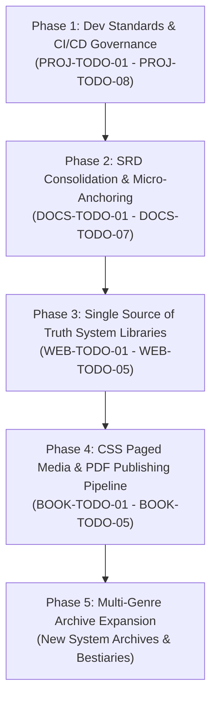

# The Multiverse TTRPG Framework — Generation 2606 Strategic Roadmap

This document outlines the official 5-Phase Strategic Roadmap for The Multiverse TTRPG Generation 2606 framework. It provides the architectural path for dev governance stabilization, canonical SRD layer refactoring (`docs/2606/`), micro-anchoring, single-source-of-truth system library decoupling, Paged.js print publishing pipeline (`.books/2606/`), and multi-genre archive expansion.

---

## 🗺️ Strategic Development Phases

---

### 📍 Phase 1: Dev Standards & CI/CD Governance Stabilization
**Status:** 🔄 *IN PROGRESS (Tasks PROJ-TODO-01 through PROJ-TODO-08)*

* **Objective:** Establish gold-standard developer tooling, JLDN Agent Governance (`.agents/AGENTS.md`), Generational Hub architecture (`.dev/2606/`), and automated GitHub Actions CI link/quality auditing (`.github/`).
* **Target Version:** `2606.1.0-bs`
* **Key Components:**
  * `.agents/AGENTS.md` Unified Agent Governance.
  * `.dev/` Generational Hub with `backlog.json`, `ideas.json`, and `ROADMAP.md`.
  * `.github/workflows/lint.yml` and `.github/scripts/validate_workspace.py`.
  * Standardized `.gitignore`, `.gitattributes`, `CONTRIBUTING.md`, `LICENSE.md`, and `CHANGELOG.md`.

---

### 📚 Phase 2: SRD Consolidation (`docs/2606/`) & Line-Level Micro-Anchoring
**Status:** ⏳ *QUEUED (Tasks DOCS-TODO-01 through DOCS-TODO-07)*

* **Objective:** Refactor root book folders (01–05) into canonical SRD structure (`docs/2606/multiverse.md`, `docs/2606/supplements/`, `docs/2606/terminology.md`) and insert invisible HTML line-level micro-anchors (``) into every individual tag, condition, approach, rule, and adversary.
* **Key Benefits:**
  * Establishes a single authoritative System Reference Document (SRD) layer matching `Vampire-Ruleset`.
  * Enables 100% precise line-level anchor jumps across markdown documentation.
  * Standardizes JSON frontmatter metadata for downstream modular supplements.

---

### ⚙️ Phase 3: "Single Source of Truth" System Libraries & Parser Decoupling
**Status:** ⏳ *QUEUED (Tasks WEB-TODO-01 through WEB-TODO-05)*

* **Objective:** Centralize all system-specific conversion rules into strict JSON configurations conforming to TypeScript interfaces, decoupling parser logic.
* **Key Components:**
  * Centralized TypeScript schema (`.web/types/SystemLibrary.ts`).
  * Baseline library configurations (`.web/config/systems/dnd5e.json`, `cyberpunk-red.json`, `w40k.json`, etc.).
  * Refactored parsers in `.web/services/parsers/` consuming centralized JSON schemas.
  * Dynamic Next.js documentation routes (`.web/app/docs/systems/[slug]/page.tsx`).

---

### 🎨 Phase 4: CSS Paged Media & PDF Publishing Pipeline (`.books/` &rarr; `books/`)
**Status:** ⏳ *QUEUED (Tasks BOOK-TODO-01 through BOOK-TODO-05)*

* **Objective:** Transition presentation layer to CSS Paged Media Level 3 and automated Paged.js PDF build pipeline matching `Vampire-Ruleset`.
* **Key Components:**
  * Staging in `.books/2606/` (`html/`, `assets/`, `pdf/`) transitioning to public `books/2606/`.
  * Custom theme styling (`multiverse_theme.css` with 2-column layout, `@page` margin boxes, and `break-inside: avoid`).
  * Automated Paged.js rendering pipeline script (`.dev/2606/build_ruleset.py`).
  * Independent dual versioning (Framework Version `2606.1.0-bs` vs Book Version `1.0`).

---

### 🚀 Phase 5: Multi-Genre Archive Expansion & Conversion Engine
**Status:** ⏳ *PLANNED*

* **Objective:** Expand the Infinite Archive with additional TTRPG conversion matrices, expanded adversaries, and deep cross-universe physics simulations.

---

*Last Updated: 2026-08-14 | Ruleset Version: 2606.1.0-bs*
